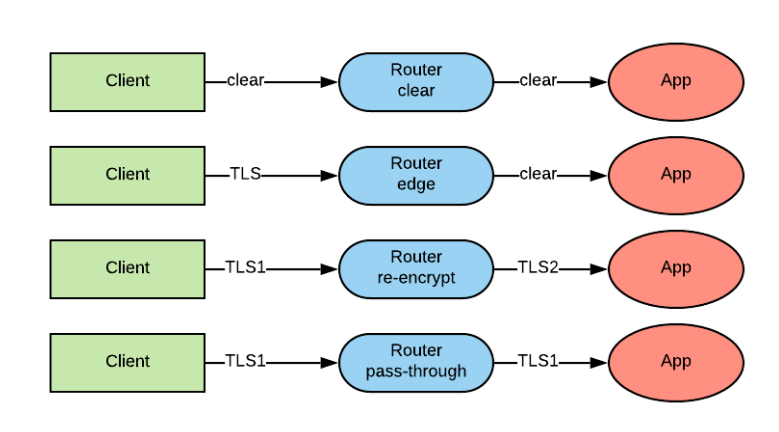
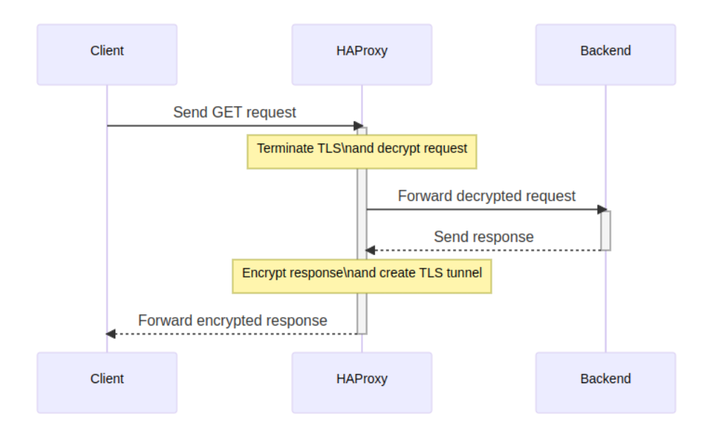
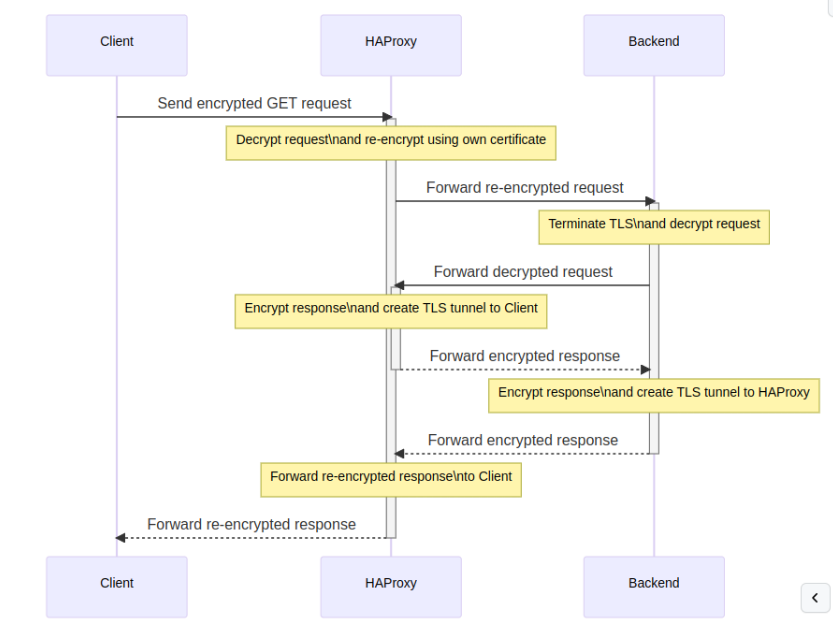
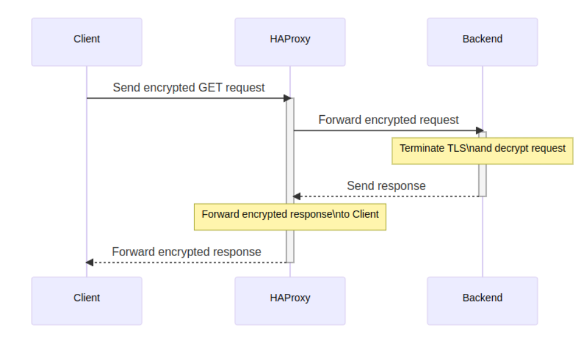

# openshift-ssl-termination

Demo the TLS/SSL edge termination types in OpenShift. Uses Service Serving Certs out of the box with OpenShift.



## (1) Create Application

```bash
oc new-project welcome
```

```bash
oc new-app quay.io/eformat/welcome:latest
```

```bash
oc exec $(oc get pod -o name -l deployment=welcome) -- ps auxww
```

## (2) Clear text (no TLS)

```bash
oc expose svc welcome
```

```bash
oc describe route/welcome
```

```bash
curl -vvv http://$(oc get route welcome -o=go-template --template='{{ .spec.host }}')
```

## (3) Edge Termination



```bash
oc patch route/welcome -p "
spec:
  port:
    targetPort: 8080-tcp
  tls:
    termination: edge
    insecureEdgeTerminationPolicy: Redirect
"
```

```bash
oc describe route/welcome
```

```bash
curl -k -vvv https://$(oc get route welcome -o=go-template --template='{{ .spec.host }}')
```

```bash
openssl s_client -showcerts \
  $(oc get route welcome -o=go-template --template='{{ .spec.host }}'):443 \
  | awk '/BEGIN CERTIFICATE/,/END CERTIFICATE/ {print $0}' | openssl x509 -text
```

## (3) Reencrypt Termination



```bash
oc annotate service welcome \
  service.beta.openshift.io/serving-cert-secret-name=welcome-certificate
```

```bash
oc get secret welcome-certificate --template='{{index .data "tls.crt"}}' \
  | base64 -d | openssl x509 -text
```

```bash
oc get secret welcome-certificate --template='{{index .data "tls.key"}}' \
  | base64 -d | openssl rsa -text
```

```bash
oc set volume deployment/welcome \
  --add -t secret \
  --secret-name=welcome-certificate \
  --name=tls-crt \
  --mount-path=/etc/ssl/certs/tls.crt \
  --sub-path=tls.crt \
  --overwrite
```

```bash
oc set volume deployment/welcome \
  --add -t secret \
  --secret-name=welcome-certificate \
  --name=tls-key \
  --mount-path=/etc/ssl/certs/tls.key \
  --sub-path=tls.key \
  --overwrite
```

```bash
oc exec $(oc get pod -o name -l deployment=welcome) -- ps auxww
```

```bash
oc patch route/welcome -p "
spec:
  port:
    targetPort: 8443-tcp
  tls:
    termination: Reencrypt
    insecureEdgeTerminationPolicy: Redirect
"
```

```bash
oc describe route/welcome
```

```bash
curl -k -vvv https://$(oc get route welcome -o=go-template --template='{{ .spec.host }}')
```

```bash
openssl s_client -showcerts \
  $(oc get route welcome -o=go-template --template='{{ .spec.host }}'):443 \
  | awk '/BEGIN CERTIFICATE/,/END CERTIFICATE/ {print $0}' | openssl x509 -text
```

## (4) Passthrough Termination



```bash
oc patch route/welcome -p "
spec:
  port:
    targetPort: 8443-tcp
  tls:
    termination: passthrough
    insecureEdgeTerminationPolicy: Redirect
"
```

```bash
oc describe route/welcome
```

```bash
curl -k -vvv https://$(oc get route welcome -o=go-template --template='{{ .spec.host }}')
```

```bash
openssl s_client -showcerts \
  $(oc get route welcome -o=go-template --template='{{ .spec.host }}'):443 \
  | awk '/BEGIN CERTIFICATE/,/END CERTIFICATE/ {print $0}' \
  | openssl x509 -text
```

## Links

Other routing related topics:

- [Ingress TLS with SNI](https://docs.openshift.com/container-platform/4.13/networking/configuring_ingress_cluster_traffic/overview-traffic.html)
- [Network Policy](https://docs.openshift.com/container-platform/4.13/networking/network_policy/about-network-policy.html)
- [IP Whitelisting](https://docs.openshift.com/container-platform/4.13/networking/routes/route-configuration.html)
- [HSTS Configuration](https://docs.openshift.com/container-platform/4.13/networking/routes/route-configuration.html#nw-enabling-hsts_route-configuration)


### Manually rotate the service CA certificate

- [docs](https://docs.openshift.com/container-platform/4.13/security/certificates/service-serving-certificate.html#manually-rotate-service-ca_service-serving-certificate)

```bash
oc get secrets/signing-key -n openshift-service-ca \
  -o template='{{index .data "tls.crt"}}' \
  | base64 --decode \
  | openssl x509 -noout -enddate
```

```bash
oc get secrets/signing-key -n openshift-service-ca -o template='{{index .data "tls.crt"}}' | base64 -d
```

### Lets Encrypt *.apps Routing Cert

CAA in Route53 add:

```bash
0 issuewild "letsencrypt.org;"
```

```bash
export LE_API=$(oc whoami --show-server | cut -f 2 -d ':' | cut -f 3 -d '/' | sed 's/-api././')
export LE_WILDCARD=$(oc get ingresscontroller default -n openshift-ingress-operator -o jsonpath='{.status.domain}')
```

```bash
cd ~/git
git clone https://github.com/Neilpang/acme.sh.git
```

```bash
~/git/acme.sh/acme.sh --issue --dns dns_aws -d ${LE_API} -d *.${LE_WILDCARD} --dnssleep 100 --force --insecure
```

```bash
oc -n openshift-ingress delete secret router-certs
oc -n openshift-ingress create secret tls router-certs --cert=/home/$USER/.acme.sh/${LE_API}/fullchain.cer --key=/home/$USER/.acme.sh/${LE_API}/${LE_API}.key
oc -n openshift-ingress-operator patch ingresscontroller default --patch '{"spec": { "defaultCertificate": { "name": "router-certs"}}}' --type=merge
```
